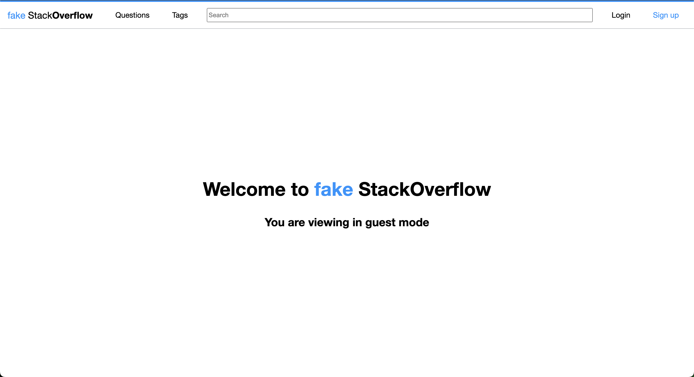
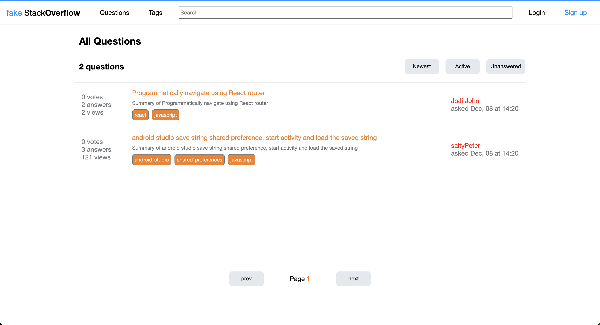
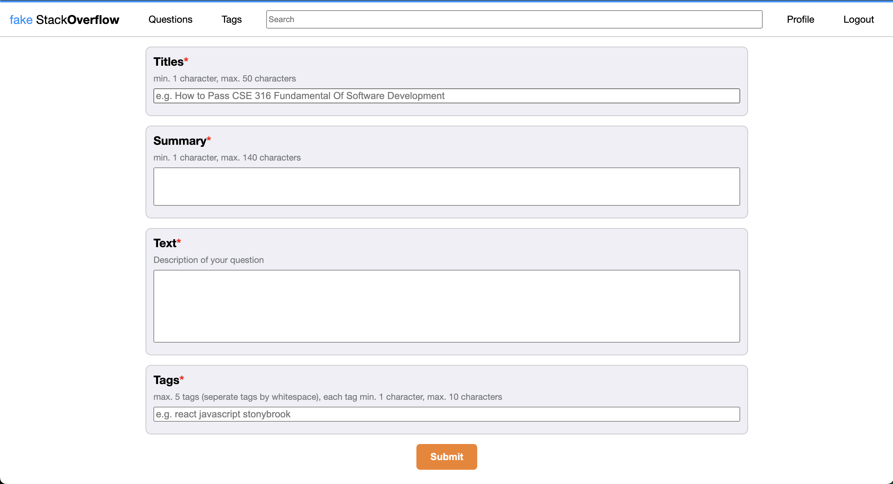
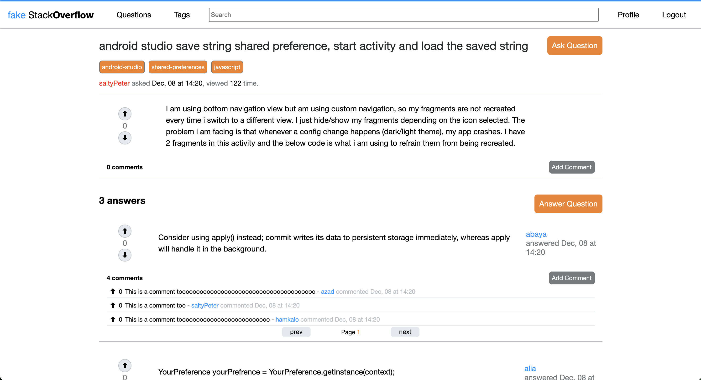
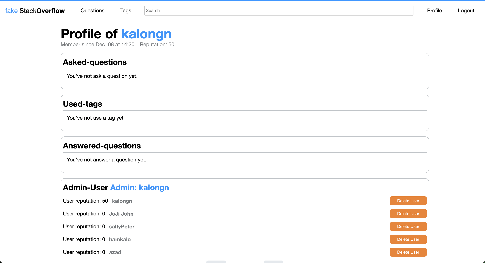

## Instructions to setup and run project
```bash
cd server
npm install
mongod
nodemon server.js
node init.js <ADMIIN_USERNAME> <ADMIN_PASSWORD>
# the admin account created will be attached with a fake email address of
# <ADMIN_USERNAME>@fake_so.com, the reputation of admin is default to 50.

cd ../client
npm install
npm start

```

Website is not deployed as it is not secure and will attempt to rebuild with the same standard in a React.js, Next.js and MongoDB / Postgresql.   
### Below are the images of the website
- Home Page

- Question Page

- Ask Question Page

- Question Detail Page

- Profile Page (Admin)
